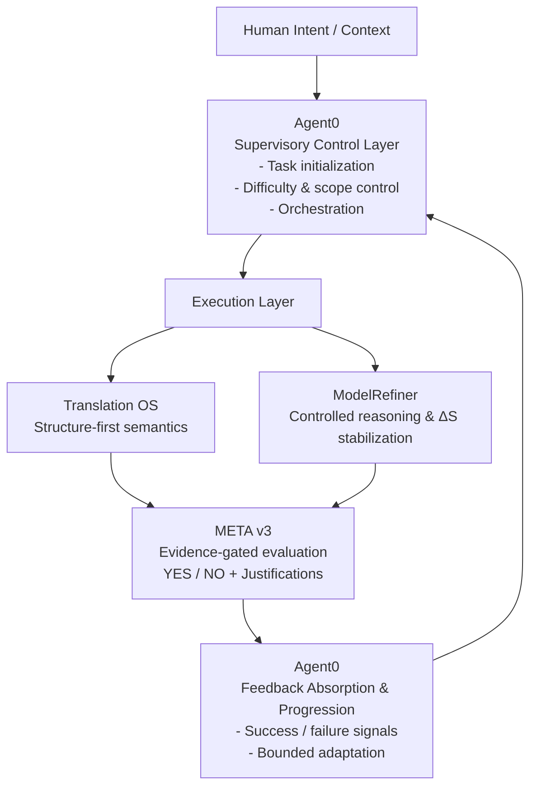

# Architecture — Unified Cognitive OS v1.0

Unified Cognitive OS (UCO) is a **supervisory cognitive system** that sits above
generation and evaluation layers to make real-world AI workflows:

- traceable  
- explainable  
- reproducible  
- and safe to operate at scale  

This repository defines the **specification**, not an implementation.

---

## 1. High-Level Concept

Most AI workflow failures are not model failures.

They are workflow failures:

- unclear task scope  
- unstable difficulty  
- hidden evaluation logic  
- feedback that cannot be absorbed structurally  
- non-reproducible decisions  

Unified Cognitive OS addresses these failures by introducing a
**supervisory control layer (Agent0)** that governs how subsystems are invoked,
evaluated, and evolved.

---

## 2. Architectural Overview

UCO is organized into three macro layers:

1. **Supervisory Layer** — task and progression control  
2. **Execution Layer** — domain-specific reasoning and generation  
3. **Evaluation Layer** — evidence-gated judgment  

These layers form a **closed operational loop**.

---

## 3. System Diagram (Mermaid)

This diagram highlights that Unified Cognitive OS is:

not a prompt framework

not an agent swarm

not a model

It is a supervisory operating system for AI workflows.

## 4. Core Subsystems and Roles
### 4.1 Agent0 — Supervisory Control Layer
Agent0 governs how tasks exist and progress.

Responsibilities include:

task initialization and scoping

curriculum and difficulty control

execution orchestration

evidence-gated feedback absorption

bounded adaptive progression

Agent0 does not generate content.
It defines the conditions under which other systems operate.

### 4.2 Translation OS — Structure-First Execution
Translation OS provides deterministic meaning-to-structure execution primitives:

semantic core extraction

structure remap

synthesis

evaluation gate integration

refinement and convergence support

Within UCO, Translation OS functions as a domain execution engine,
invoked and constrained by Agent0.

### 4.3 ModelRefiner — Controlled Reasoning
ModelRefiner provides controlled reasoning and variance management:

structured reasoning layers

controlled creative operators

ΔS (structural entropy) stabilization

variation induction under constraints

ModelRefiner is never autonomous.
It operates only within bounds defined by Agent0 and evaluated by META v3.

### 4.4 META v3 — Evidence-Gated Evaluation
META v3 provides the evaluation and judgment layer:

binary gating (YES / NO)

explicit issue descriptions

justification traces

evidence chain logic

In Unified Cognitive OS, evaluation is not auxiliary.
It is a governance primitive.

## 5. Operational Loop (Closed Control Cycle)
Unified Cognitive OS operates as a closed loop:

Intent Capture — human context enters the system

Task Formation — Agent0 defines a bounded task

Execution — domain engines run under constraints

Evaluation — META v3 produces evidence-gated verdicts

Feedback Absorption — Agent0 converts verdicts into signals

Progression — difficulty and scope are adaptively updated

This closed loop prevents silent drift and uncontrolled escalation.

## 6. Determinism and Governance Guarantees
Unified Cognitive OS enforces the following invariants:

no hidden evaluation criteria

no unbounded autonomy

no intuition-only feedback absorption

no progression without evidence

no generation without evaluability

These are architectural constraints, not best practices.

## 7. Relationship to Translation OS
Translation OS defines a deterministic pipeline for translation and QA.

Unified Cognitive OS defines a deterministic supervisory layer that can govern:

Translation OS pipelines

evaluation pipelines

prompt workflows

multimodal assessment workflows

In short:

Translation OS is a domain OS.
Unified Cognitive OS is the supervisory OS above multiple domain OS layers.

## 8. Minimal Implementation Philosophy
Unified Cognitive OS is intentionally designed so that:

the specification can be reviewed without a running implementation

enterprises can implement it in their existing stack

the system remains model-agnostic

This mirrors the design philosophy of Translation OS:
a reproducible operating model, not a product demo.

## 9. Status and Roadmap
Version: v1.0

Status: specification complete

Design posture: enterprise-safe, evidence-governed

Next milestone: v1.5

multi-agent coordination

task-space visualization

## Summary
Unified Cognitive OS is not designed to make AI more powerful.

It is designed to make AI operable.

By introducing a supervisory layer above generation and evaluation,
it ensures that AI systems remain accountable, stable, and scalable
in real-world environments.

